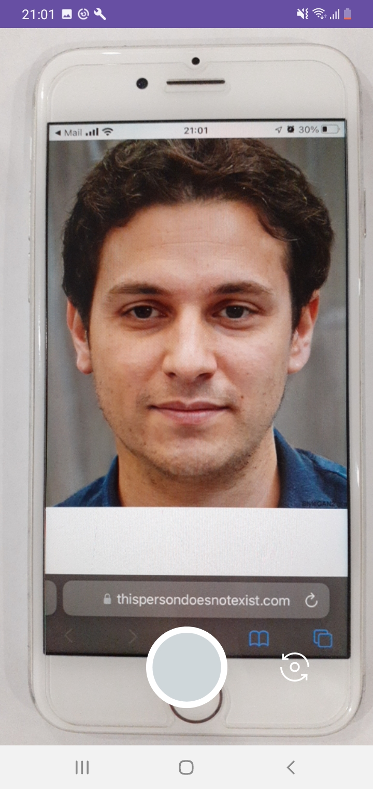
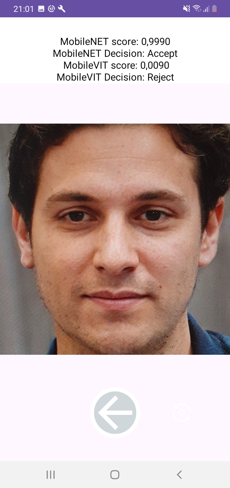

# mFacePAD

## Face Presentation Attack Detection on Mobile Devices

mFacePAD is an application designed for detecting face presentation attacks on mobile devices. The application allows for comparing the effectiveness of MobileNetv3 and MobileViTv2 architectures used for detecting presentation attacks.

## Screenshots

<kbd></kbd>
<kbd></kbd>

## License

This project is licensed under the MIT License. For more information, see the [LICENSE](LICENSE) file.